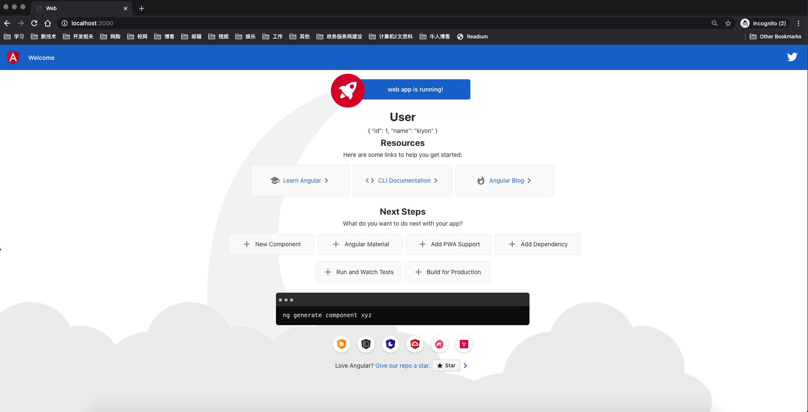

# `fiber`+`angular`开发`web`
[fiber](https://docs.gofiber.io/)是最近出道的一款基于[fasthttp](https://github.com/valyala/fasthttp)的`web`框架。

> *Fiber* is an Express inspired *web framework* build on top of Fasthttp, the *fastest* HTTP engine for Go. Designed to *ease* things up for *fast* development with *zero memory allocation* and *performance* in mind.

我们可以用`fiber`快速开发`api`接口，再配合`angular`实现一个`web`项目。

> 环境：macos 10.15.4 + go 1.14.1 + fiber 1.11.1 + angular 9.1.6

## 新建项目
我们创建一个新的目录叫`fiblar-demo`：

```bash
md fiblar-demo && cd fiblar-demo
```

再使用`go mod`初始化项目：

```bash
go mod init github.com/kiyonlin/fiblar-demo
```

新建一个`main.go`文件，内容如下：

```go
package main

import (
	"github.com/gofiber/fiber"
	"log"
)

func main() {
	// Create new Fiber instance
	app := fiber.New()

	// serve Single Page application on "/public"
	// assume static file at dist folder
	app.Static("/", "public")

    // intercept api routes
	apiGroup := app.Group("/api")
	{
		apiGroup.Get("/user", func(c *fiber.Ctx) {
			c.JSON(fiber.Map{"id": 1, "name": "kiyon"})
		})
	}
    
    // other routes just return `public/index.html`, angular will handle them
	app.Get("/*", func(c *fiber.Ctx) {
		if err := c.SendFile("public/index.html"); err != nil {
			c.Next(fiber.ErrInternalServerError)
		}
	})

	// Start server on http://localhost:3000
	log.Fatal(app.Listen(3000))
}
```

## 创建新的`angular`项目
使用[angular-cli](https://angular.cn/cli)创建一个新的`angular`项目：

```bash
ng new web
```

编辑`web/angular.json`：

```json
{
  "other-configs": {},
  "build": {
    "builder": "@angular-devkit/build-angular:browser",
    "options": {
      "outputPath": "../public"
    }
  }
}
```

这样就可以把编译后的`angular`项目输出到跟`web`同一级的`public`目录，上述基于`fiber`的程序会读取`public`目录下的文件。

接下来我们给`web/src/app/app.component.ts`加一下`api`请求：

```typescript
// ...
export class AppComponent {
  title = 'web';

  user: any;

  constructor(private http: HttpClient) {
    this.http.get('/api/user').subscribe(data => this.user = data);
  }
}
```

这样进入首页后就会触发`/api/user`的请求，我们把获取到的`user`展示到页面`web/src/app/app.component.html`上：

```html
  <!-- ... -->
  <!-- Resources -->
  <h1>User</h1>
  <p>{{user | json}}</p>
  <h2>Resources</h2>
  <p>Here are some links to help you get started:</p>
  <!-- ... -->
```

再在`web/package.json`中添加一个脚本，供开发时使用：

```json
{
  "scripts": {
    "build": "ng build --prod",
    "build:watch": "ng build --watch"
  }
}
```

## 运行项目
我们使用[air](https://github.com/cosmtrek/air)在开发过程中热更新服务，按照文档安装即可，以下是`.air.conf`的核心内容：

```toml
root = "."
tmp_dir = "tmp"
[build]
cmd = "go build -o ./tmp/main ./main.go"
bin = "tmp/main"
include_ext = ["go", "toml"]
exclude_dir = ["assets", "tmp", "vendor", "web"]
```

最后，我们执行`air`监听后端项目，执行`cd web && yarn run build:watch`监听前端项目，访问`localhost:3000`查看结果：


## 总结
本文展示了综合`fiber`和`angular`开发`web`项目的一个小例子，权当抛砖引玉，有兴趣的同学可以继续深入研究。最后，我们稍微做下总结：

- 通过`fiber`的静态文件服务，我们可以直接提供`angular`输出的`html`页面
- 服务端拦截`api`路由，前端调用接口时，加上`api`前缀即可，无跨域问题，其他路由交给`angular`处理

完整[demo](http://github.com/kiyonlin/fiblar-demo)，以上。
